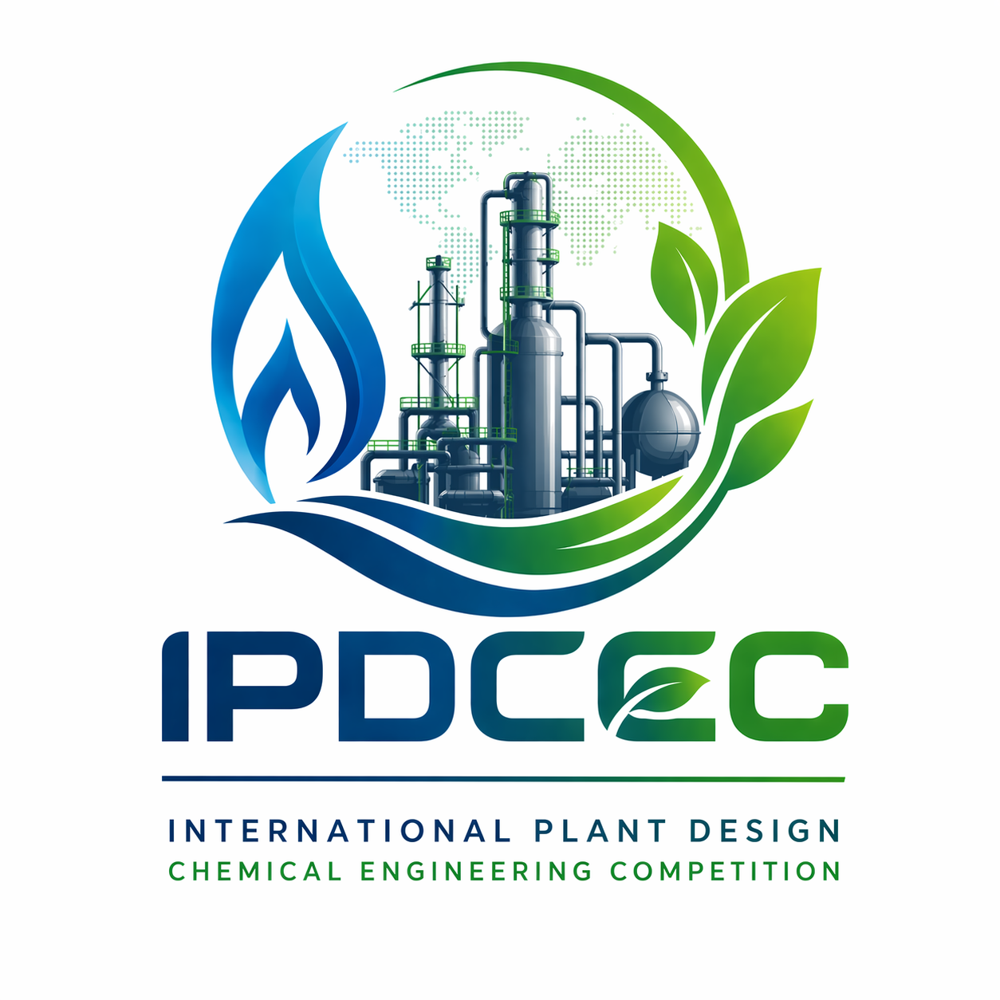

# IPDCEC Online

### International Plant Design Chemical Engineering Competition 2026

<p align="center">
  
</p>

<p align="center">
  <strong>Official Website for the International Plant Design Chemical Engineering Competition</strong>
</p>

<p align="center">
  
  
  
  
</p>

---

## 🌐 Overview

**IPDCEC Online** is the official web platform for the **International Plant Design Chemical Engineering Competition 2026**.

This website provides centralized access to competition information, registration, guidebook, timeline, payment details, official announcements, and contact information.

The competition aims to encourage chemical engineering students to design innovative, efficient, safe, and sustainable chemical plants based on real-world industrial challenges.

---

## 🎯 Objectives

* Provide official and centralized competition information
* Support an efficient participant registration process
* Promote innovation in chemical plant design
* Encourage sustainable and industry-based engineering solutions
* Foster international collaboration among chemical engineering students

---

## ✨ Website Features

* Competition overview
* Bilingual interface: English and Indonesian
* Registration link
* Official guidebook download
* Countdown timer
* Competition timeline
* Payment information
* Contact person section
* Official social media links
* Responsive web design

---

## 🏗️ Project Structure

```text
ipdcec/
├── index.html
├── ipdcec-logo.png
├── mascot-ipdcec.png
└── README.md
```

---

## 🛠️ Built With

* HTML5
* CSS3
* JavaScript
* Responsive Web Design

---

## 🚀 Deployment

The website is planned to be accessible at:

```text
https://ipdcec.online
```

This project can also be deployed using:

* GitHub Pages
* Netlify
* Vercel
* Cloudflare Pages

---

## 📅 Competition

**Event:** International Plant Design Chemical Engineering Competition 2026
**Organizer:** Chemical Engineering Department, Faculty of Engineering, Universitas Malikussaleh
**Location:** Aceh, Indonesia
**Format:** Offline Competition

---

## 📧 Contact

For official inquiries, please contact:

```text
teknik-kimia@unimal.ac.id
```

---

## 👨‍💻 Author

**Nasrul ZA**
Universitas Malikussaleh
Email: [nasrulza@unimal.ac.id](mailto:nasrulza@unimal.ac.id)

---

## 📄 License

This project is developed for the official IPDCEC 2026 competition platform.

---

<p align="center">
  <strong>IPDCEC 2026 — Designing Sustainable Chemical Plants for a Better Global Future</strong>
</p>
